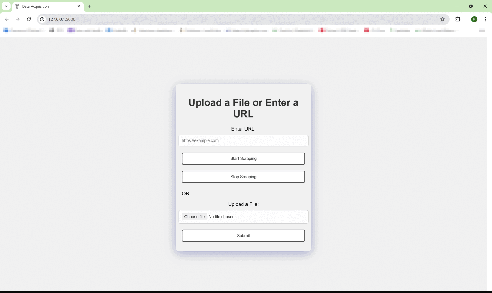

# Acquisition module

The module encompasses multiple functionalities aimed at extracting and processing diverse data sources such as PDFs, CSVs, and HTML into text, alongside web scraping via APIs for content extraction. It includes advanced video processing capabilities using OpenAI Whisper and FFmpeg for converting video content to text, as well as context understanding for videos lacking audio using LLM GPT Vision Pro. Multithreading is implemented to automate scraping tasks efficiently. Additionally, to avoid constant reliance on external APIs like LLM, the project emphasizes training custom AI models for filtering malicious prompts. This approach involves generating a dedicated dataset and training an AI model, with further details available in the Malicious Prompt Filter Repository.



## Installation

### Clone the Repository

```bash
git clone https://github.com/Kartik-Katkar/Multifaceted-Impact-of-Mergers-and-Acquisitions-on-Stock-Price-Fluctuations
cd Data Acquisition module
```

### Setup Virtual Environment

```bash
cd flask_app
python -m venv venv
source venv/bin/activate  # On Windows, use `venv\Scripts\activate`
```

### Install Dependencies

```bash
pip install -r requirements.txt
```

### Environment Variables

Create a `.env` file in the `flask_app` directory and add the following:

```plaintext
SCRAPER_API_KEY = 'YOUR_SCRAPER_API_KEY'
GEMINI_API_KEY = 'YOUR_GEMINI_API_KEY'
```

Replace `YOUR_SCRAPER_API_KEY` and `YOUR_GEMINI_API_KEY` with your actual API keys.

## Usage

### Video Processing

Ensure `ffmpeg` is installed: [Install ffmpeg](https://www.youtube.com/watch?v=jZLqNocSQDM)

## Multithreading

Used multithreading for automating the scraping and appending process.

## Model Training

For model training and code, visit: [Malicious Prompt Filter Repository](https://github.com/Kartik-Katkar/Malicious-Prompt-Filter-for-RAG-Database/tree/main)
